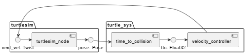

# Executive Summary

This folder is dedicated to the documentation based on which the package is going to be created.

# Architecture

## Component diagram
turtle_sys_component.puml


# Requirements
## Intro
R1, R2, ... -- requirements
L1, L2, ... -- limitations

## Node ```time_to_collision```
**L1**. The turtle moves within a rectangle which is limited by walls with corners (1,1) (1,10), (10,1), (10,10)

**R1**. ```time_to_collision``` shall calculate absolute velocity of the turtle based along X and Y axes ```(Vax, Vay)``` on the values from ```pose``` topic.

**R2**. ```time_to_collision``` shall calculate the expected time to collision ```time``` with the nearest wall based on ```(Vax, Vay)```

**R3**. ```time_to_collision``` shall publish the calculated ```time``` as ```ttc``` topic of the type ```Float32```

## Node ```time_to_collision```
**L1**. Linear speed of the turtle shall not exceed 1.

**R1**. At the start of the node, the turtle completes a turn to a random angle between 0 and 90 deg.

**R2**. After the turn, the turtle starts moving forward with the speed of 1.

**R3**. If time to collision is under 2, the turtle turns until time to collision is above 3.

**R4**. After the turtle completes the turn, it continues moving forward with the speed of 1.